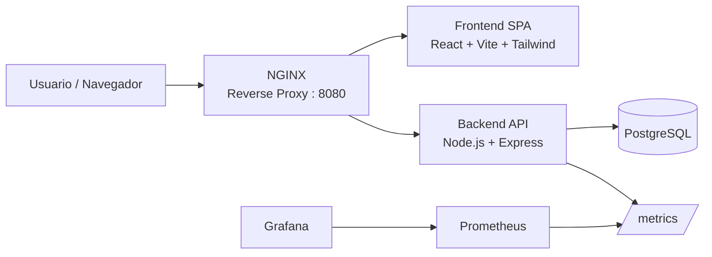

# TaskApp — Gestión de Tareas Académicas

Proyecto Integrado: Herramientas y Servicios para Desarrolladores en la Web.

**Problema que resuelve:** estudiantes y docentes necesitan un lugar simple y centralizado para registrar, dar seguimiento y marcar como completadas las tareas académicas (sector **Educación**), evitando depender de notas sueltas, chats o memoria.

> Aunque el trabajo se entrega de forma individual, el proyecto se documenta y organiza como si fuera un equipo multidisciplinario, cumpliendo todos los roles definidos por la cátedra (ver sección [Roles](#roles-del-equipo)).

---

## Índice

1. [Arquitectura](#arquitectura)
2. [Stack tecnológico](#stack-tecnológico)
3. [Cómo correr el proyecto localmente](#cómo-correr-el-proyecto-localmente)
4. [API REST](#api-rest)
5. [Pruebas automatizadas](#pruebas-automatizadas)
6. [CI/CD](#cicd)
7. [Despliegue en la nube](#despliegue-en-la-nube)
8. [Kubernetes](#kubernetes)
9. [Monitoreo y observabilidad](#monitoreo-y-observabilidad)
10. [Accesibilidad y rendimiento](#accesibilidad-y-rendimiento)
11. [Roles del equipo](#roles-del-equipo)
12. [Metodología ágil](#metodología-ágil)
13. [Reflexión: ética, seguridad y sostenibilidad](#reflexión-ética-seguridad-y-sostenibilidad)

---

## Arquitectura



- El **usuario** entra por NGINX, que decide si la petición es para el frontend o para la API (`/api/*`).
- El **frontend** (React) consume la API para mostrar y modificar las tareas.
- El **backend** (Express) valida los datos, habla con PostgreSQL y expone un endpoint `/metrics`.
- **Prometheus** consulta `/metrics` cada 10 segundos y **Grafana** visualiza esos datos en un dashboard.

## Stack tecnológico

| Capa | Tecnología | Por qué |
|------|-----------|---------|
| Frontend | React 18 + Vite + Tailwind CSS | SPA rápida, estilos modulares, accesible |
| Backend | Node.js + Express | API REST simple y ampliamente usada en la industria |
| Base de datos | PostgreSQL 16 | Relación clara entre tareas, robusta y estándar |
| Contenedores | Docker + Docker Compose | Mismo entorno en cualquier máquina |
| Orquestación | Kubernetes (minikube/k3s) | Auto-recuperación y escalado de réplicas |
| Proxy/Balanceo | NGINX | Punto único de entrada y balanceo de carga |
| CI/CD | GitHub Actions | Lint + pruebas automáticas en cada push |
| Pruebas de API | Postman / Newman | Pruebas funcionales de los endpoints |
| Monitoreo | Prometheus + Grafana | Observabilidad de peticiones y salud del sistema |
| Hosting frontend | Vercel / Netlify | Deploy automático conectado al repositorio |

## Cómo correr el proyecto localmente

### Opción A: con Docker (recomendada, todo junto)

```bash
git clone <URL-DE-TU-REPOSITORIO>
cd proyecto-integrado
docker compose up --build
```

Una vez levantado:

| Servicio | URL |
|----------|-----|
| Aplicación completa (vía NGINX) | http://localhost:8080 |
| Frontend directo | http://localhost:5173 |
| Backend / API | http://localhost:4000 |
| Prometheus | http://localhost:9090 |
| Grafana (usuario: `admin`, clave: `admin123`) | http://localhost:3001 |

### Opción B: sin Docker (desarrollo manual)

```bash
# Backend
cd backend
cp .env.example .env
npm install
npm run dev

# Frontend (en otra terminal)
cd frontend
cp .env.example .env
npm install
npm run dev
```

> Necesitas un PostgreSQL corriendo localmente con las credenciales de `backend/.env.example`, o puedes levantar solo ese servicio con `docker compose up postgres`.

## API REST

Base URL: `/api/tareas`

| Método | Ruta | Descripción |
|--------|------|-------------|
| GET | `/api/tareas` | Lista todas las tareas |
| GET | `/api/tareas/:id` | Obtiene una tarea puntual |
| POST | `/api/tareas` | Crea una tarea (`titulo` obligatorio) |
| PUT | `/api/tareas/:id` | Actualiza campos de una tarea |
| DELETE | `/api/tareas/:id` | Elimina una tarea |
| GET | `/health` | Estado del servicio |
| GET | `/metrics` | Métricas en formato Prometheus |

La validación de datos (seguridad básica) rechaza tareas sin título con un `400`, y todos los errores devuelven un JSON descriptivo en vez de exponer detalles internos sensibles.

## Pruebas automatizadas

- **Backend (Jest + Supertest):** `cd backend && npm test`
- **API (Postman/Newman):** colección en `backend/postman/taskapp.postman_collection.json`, se ejecuta automáticamente en CI y también localmente:
  ```bash
  npx newman run backend/postman/taskapp.postman_collection.json
  ```
- **Frontend (Lighthouse):** correr Chrome DevTools → pestaña *Lighthouse* sobre la SPA desplegada, evaluando rendimiento, accesibilidad y SEO.

## CI/CD

El workflow `.github/workflows/ci.yml` se ejecuta en cada `push`/`pull request` y corre 3 jobs en paralelo cuando aplica:

1. **Backend:** instala dependencias, corre `eslint` y `jest`.
2. **Frontend:** instala dependencias, corre `eslint` y genera el build de producción.
3. **Pruebas de API:** levanta un PostgreSQL temporal, arranca el backend y corre la colección de Postman con Newman.

El **frontend** además se despliega automáticamente en cada push a `main` gracias a la integración nativa de Vercel/Netlify con GitHub (deploy preview en cada PR, deploy a producción en `main`).

## Despliegue en la nube

1. Crear cuenta en [Vercel](https://vercel.com) o [Netlify](https://netlify.com) y conectar el repositorio.
2. Configurar:
   - **Root directory:** `frontend`
   - **Build command:** `npm run build`
   - **Output directory:** `dist`
   - **Variable de entorno:** `VITE_API_URL` apuntando al backend desplegado.
3. El backend puede desplegarse en cualquier servicio compatible con contenedores Docker (Render, Railway, un VPS con Docker, etc.), usando el `Dockerfile` de `backend/`.

## Kubernetes

Manifiestos en `k8s/`, pensados para minikube o k3s:

```bash
minikube start
eval $(minikube docker-env)          # construir las imagenes DENTRO del cluster
docker build -t taskapp-backend:latest ./backend
docker build -t taskapp-frontend:latest ./frontend

kubectl apply -f k8s/
kubectl get pods -n taskapp          # verificar que todo esté "Running"
kubectl get services -n taskapp
```

El backend y el frontend corren con **2 réplicas** cada uno: si un pod falla, Kubernetes lo reemplaza automáticamente y reparte el tráfico entre las copias sanas (auto-recuperación + balanceo).

## Monitoreo y observabilidad

- El backend expone métricas estándar de Node.js (uso de memoria, CPU, event loop) y una métrica propia `http_requests_total` mediante `prom-client`.
- **Prometheus** las recolecta cada 10 segundos (`monitoring/prometheus.yml`).
- **Grafana** ya viene con el datasource y un dashboard pre-cargados (carpeta `monitoring/grafana/provisioning/`), visibles apenas se levanta el contenedor, mostrando: peticiones por segundo, peticiones por código de estado, memoria del backend y disponibilidad del servicio.

## Accesibilidad y rendimiento

- Etiquetas `<label>` asociadas a cada campo de formulario.
- Atributos `aria-label`, `aria-live` y `aria-pressed` en elementos interactivos.
- Contraste de color verificado (texto oscuro sobre fondo claro y viceversa).
- Soporte para `prefers-reduced-motion` (usuarios sensibles a animaciones).
- HTML semántico (`header`, `main`, `footer`, `ul`/`li`) para lectores de pantalla.

## Roles del equipo

| Rol | Responsabilidad | En este proyecto |
|-----|------------------|-------------------|
| Scrum Master | Organiza sprints, retrospectivas y el tablero | Asumido por el autor |
| Backend | API, base de datos, seguridad | Asumido por el autor |
| Frontend | SPA, accesibilidad, UX | Asumido por el autor |
| DevOps | Docker, CI/CD, Kubernetes, monitoreo | Asumido por el autor |
| Documentador | README, manuales, diagramas | Asumido por el autor |

Al ser un trabajo individual, una sola persona asumió los cinco roles de forma secuencial por sprint, documentando cada entrega como lo haría cada rol por separado.

## Metodología ágil

Se trabajó en **3 sprints cortos** usando un tablero Kanban (GitHub Projects, columnas *To Do / In Progress / Done*):

1. **Sprint 1:** repositorio, backend y base de datos.
2. **Sprint 2:** frontend, integración con la API y pruebas.
3. **Sprint 3:** contenedores, Kubernetes, monitoreo y documentación final.

Al cierre de cada sprint se redactó una breve retrospectiva (`docs/RETROSPECTIVAS.md`) con qué funcionó, qué no, y qué se ajustó para el siguiente sprint.

## Reflexión: ética, seguridad y sostenibilidad

**Ética digital:** la aplicación solo almacena información estrictamente necesaria (título, materia, fecha), sin datos personales sensibles, siguiendo el principio de minimización de datos.

**Seguridad:** las consultas a la base de datos usan parámetros preparados (`$1, $2...`) para prevenir inyección SQL; las credenciales se inyectan por variables de entorno y nunca quedan escritas en el código fuente; los errores del servidor no exponen detalles internos al cliente.

**Sostenibilidad tecnológica:** se usan imágenes base `alpine` (mucho más livianas) para reducir el consumo de almacenamiento y energía en los contenedores; Kubernetes solo mantiene la cantidad de réplicas necesarias, evitando sobre-aprovisionar recursos; el monitoreo con Prometheus permite detectar consumo anómalo de recursos a tiempo.

---

*Documentación generada como parte del Proyecto Integrado: Herramientas y Servicios para Desarrolladores en la Web.*
# taskapp

